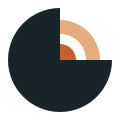

```{raw} html
<div class="ore-hero">
  
</div>
```

# Open Resources for Earth Sciences

```{raw} html
<p class="ore-tagline">Free workshops · Open resources · Community built</p>
```

**ore** is a community project that runs regular online workshops for geoscience
students and keeps a curated library of free, open-access learning resources.
Every page on this site is a Markdown file, and anyone can contribute.

:::{admonition} Next workshop: Introduction to Ore Deposit Models
:class: tip

[DD] October 2026 · 16:00 IST · Online · Speaker: [Speaker name]

[Workshop details](workshops/2026-10-ore-deposit-models.md) · [Register](https://forms.gle/your-form-link)
:::

## Why ore?

- **Free for every student.** All workshops and listed resources are free to use.
- **Learn from practitioners.** Sessions are taught by researchers and industry geologists.
- **Hands-on.** Workshops come with slides, data and notebooks you can reuse.
- **Open and editable.** Resources are plain Markdown, improved by the community.

## Browse resources

::::{grid} 1 2 2 4
:gutter: 3

:::{grid-item-card} Ore Geology
:link: resources/ore-geology
:link-type: doc
Deposit models, mineral databases and exploration
:::

:::{grid-item-card} Petrology & Mineralogy
:link: resources/petrology-mineralogy
:link-type: doc
Minerals, thin sections and rock databases
:::

:::{grid-item-card} Geochemistry
:link: resources/geochemistry
:link-type: doc
Geochemical databases and data tools
:::

:::{grid-item-card} Structural Geology
:link: resources/structural-geology
:link-type: doc
Stereonets, deformation and 3D modelling
:::

:::{grid-item-card} Geophysics
:link: resources/geophysics
:link-type: doc
Seismology, potential fields and inversion
:::

:::{grid-item-card} Remote Sensing & GIS
:link: resources/remote-sensing-gis
:link-type: doc
Satellite imagery, GIS software and maps
:::

:::{grid-item-card} Open Datasets
:link: resources/datasets
:link-type: doc
Maps and data from geological surveys
:::

:::{grid-item-card} Software & Code
:link: resources/software
:link-type: doc
Open-source tools and Python libraries
:::
::::

## Quickstart

1. Check the [upcoming workshops](workshops/index.md).
2. Register using the form on the workshop page.
3. Join online at the listed time. Recordings and slides are posted afterwards.

See [How to join](getting-started/join.md) for details.

## Contributing

Found a great open resource, or want to teach a session? Read the
[contributing guide](community/contributing.md). You can also
[suggest a resource](https://github.com/openresearth/openresearth.github.io/issues/new?template=suggest-resource.md)
or [propose a workshop](https://github.com/openresearth/openresearth.github.io/issues/new?template=propose-workshop.md)
without editing any files.

## Contact

ore is run by [organisers]. Email: [email address]

## License

Content on this site is licensed under [CC BY 4.0](community/license.md).

```{toctree}
:hidden:
:caption: Getting Started

getting-started/about
getting-started/join
```

```{toctree}
:hidden:
:caption: Workshops

workshops/index
```

```{toctree}
:hidden:
:caption: Resources

resources/index
resources/ore-geology
resources/petrology-mineralogy
resources/geochemistry
resources/structural-geology
resources/geophysics
resources/remote-sensing-gis
resources/datasets
resources/software
```

```{toctree}
:hidden:
:caption: Community

tutorials/index
community/contributing
community/license
```
